# Product Requirements Document (PRD)

# 1. INTRODUCTION

## 1.1 Purpose

This Product Requirements Document (PRD) specifies the requirements for developing a Prior Authorization (PA) Management System - a web-based application designed to streamline the prior authorization process for prescription drugs. This document serves as the primary reference for:

- Development and QA teams implementing the system
- Project managers and stakeholders tracking deliverables
- Business analysts defining integration requirements
- Compliance officers ensuring HIPAA adherence

## 1.2 Scope

The Prior Authorization Management System will be a comprehensive web application that facilitates:

- Provider-side workflow:
  - EMR integration for patient data retrieval
  - Drug formulary verification
  - PA form submission and tracking
  - Document attachment management
  - Real-time status monitoring

- Payer-side workflow:
  - PA request review dashboard
  - AI-assisted criteria matching
  - Decision management
  - Provider communication
  - Policy criteria database integration

The system will initially support UnitedHealthcare as the primary payer with architecture designed for multi-payer expansion. Core technologies include:

- Frontend: React.js
- Backend: Python-based RESTful APIs
- Infrastructure: Native AWS services
- Integration: FHIR/Da Vinci protocols
- AI: Configurable LLM integration starting with Claude 3.5

The system will significantly reduce PA processing time, improve approval rates, and enhance communication between providers and payers while maintaining strict HIPAA compliance and data security standards.

# 2. PRODUCT DESCRIPTION

## 2.1 Product Perspective

The Prior Authorization Management System operates as a web-based application within the broader healthcare ecosystem, interfacing with:

- Electronic Medical Record (EMR) systems via FHIR/Da Vinci protocols
- Payer systems through secure APIs
- Drug formulary databases
- Policy criteria databases
- AWS cloud infrastructure components

The system functions as an independent platform while maintaining critical integrations with existing healthcare IT infrastructure:

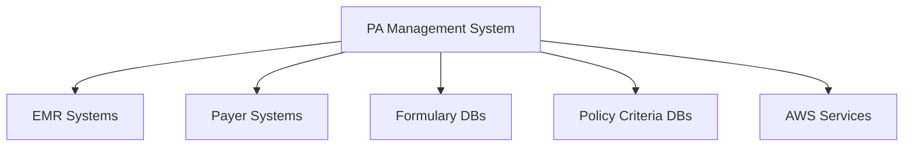

## 2.2 Product Functions

The system provides these primary functions:

Provider-Side:
- EMR connectivity and patient data retrieval
- Insurance eligibility verification
- Formulary status checking
- PA form auto-population and submission
- Document management and attachment handling
- Request status tracking and notifications
- Drug information lookup and clinical decision support

Payer-Side:
- Prior authorization request review dashboard
- AI-assisted criteria matching with patient records
- Decision management workflow
- Provider communication channel
- Policy criteria database integration
- Request escalation handling
- Analytics and reporting

## 2.3 User Characteristics

### Healthcare Providers
- Primary users: Physicians, nurse practitioners, medical staff
- Technical proficiency: Moderate, familiar with EMR systems
- Usage frequency: Daily
- Key needs: Efficiency, accuracy, status visibility

### Payer Representatives
- Primary users: PA reviewers, medical directors
- Technical proficiency: High, experienced with healthcare systems
- Usage frequency: Full-time daily use
- Key needs: Decision support, compliance adherence

### System Administrators
- Technical proficiency: Expert level
- Usage frequency: As needed for maintenance
- Key needs: System monitoring, user management

## 2.4 Constraints

Technical Constraints:
- Must use native AWS services for infrastructure
- Required to implement FHIR/Da Vinci protocols
- Must maintain HIPAA compliance
- 3-second maximum dashboard load time
- 99.9% uptime requirement

Regulatory Constraints:
- HIPAA compliance requirements
- State-specific PA form requirements
- Healthcare data privacy regulations
- Electronic prescription regulations

Security Constraints:
- End-to-end encryption requirement
- Multi-factor authentication
- Audit trail maintenance
- Secure data transmission protocols

## 2.5 Assumptions and Dependencies

Assumptions:
- EMR systems support FHIR integration
- Payers maintain updated policy criteria documentation
- Users have reliable internet connectivity
- Basic technical proficiency of end users

Dependencies:
- EMR system availability and API stability
- Payer system integration capabilities
- AWS service availability
- Claude 3.5 or alternative LLM availability
- Drug database service uptime
- Formulary database accuracy
- Policy criteria database updates
- FHIR/Da Vinci protocol standards

# 3. PROCESS FLOWCHART

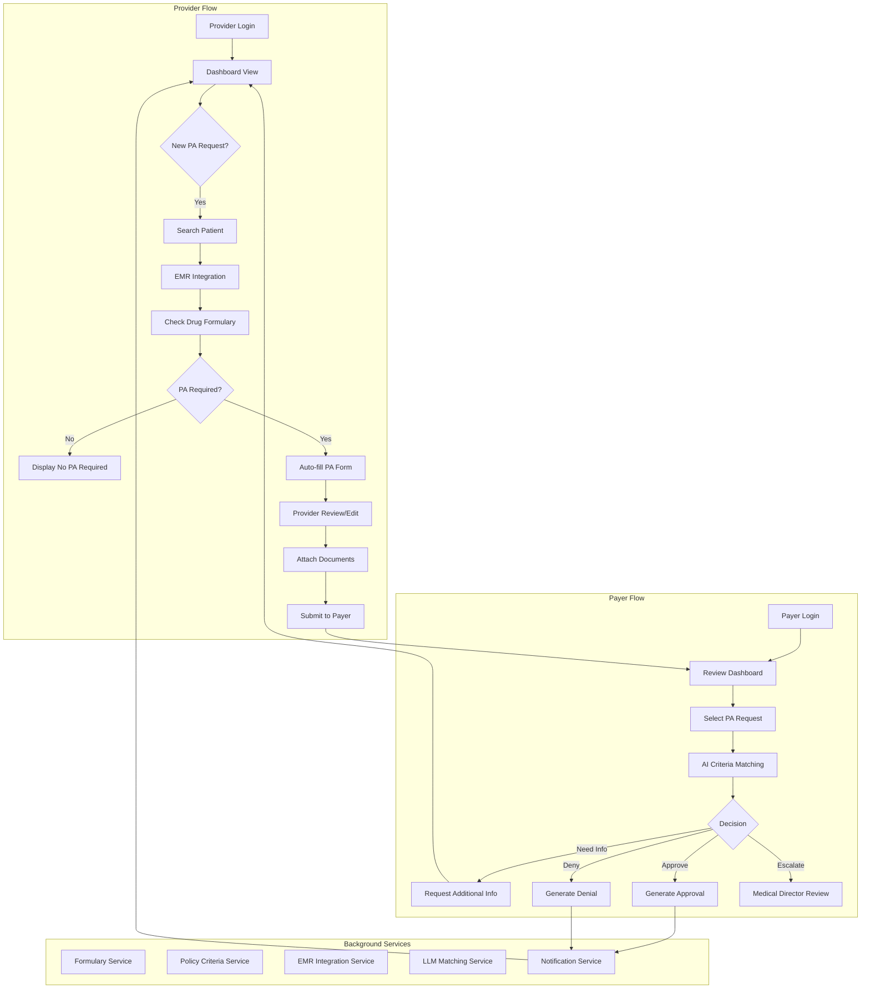

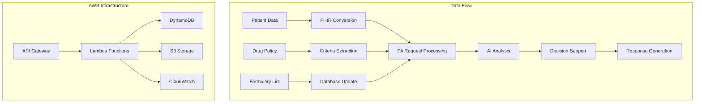

# 4. FUNCTIONAL REQUIREMENTS

## 4.1 Provider Portal Features

### F1. Provider Authentication & Dashboard
**ID**: PRV-AUTH-001  
**Description**: Secure provider login and dashboard display  
**Priority**: P0 - Critical  

| Requirement ID | Requirement Description | Acceptance Criteria |
|---------------|------------------------|-------------------|
| F1.1 | Multi-factor authentication system | - Email/password authentication - MFA integration with SMS/authenticator app - Session management with 15-minute timeout |
| F1.2 | Dashboard view of PA requests | - Display all PA requests with status - Sort/filter capabilities - Real-time status updates |
| F1.3 | Request statistics and metrics | - Success/denial rates - Average processing time - Pending requests count |

### F2. EMR Integration
**ID**: PRV-EMR-001  
**Description**: FHIR-based EMR connectivity  
**Priority**: P0 - Critical  

| Requirement ID | Requirement Description | Acceptance Criteria |
|---------------|------------------------|-------------------|
| F2.1 | EPIC EMR integration | - FHIR R4 compliance - Patient demographics pull - Clinical data retrieval |
| F2.2 | Patient search functionality | - Search by MRN, name, DOB - Real-time results - Patient matching verification |
| F2.3 | Data mapping and transformation | - FHIR resource mapping - Data validation - Error handling |

### F3. Formulary Verification
**ID**: PRV-FORM-001  
**Description**: Drug formulary status checking  
**Priority**: P1 - High  

| Requirement ID | Requirement Description | Acceptance Criteria |
|---------------|------------------------|-------------------|
| F3.1 | Formulary database integration | - UHC formulary data sync - Daily updates - Version control |
| F3.2 | PA requirement checking | - Real-time verification - Clear PA/non-PA status display - Formulary alternatives |
| F3.3 | Drug information lookup | - Clinical details access - Dosing guidelines - Contraindications |

## 4.2 Payer Portal Features

### F4. PA Review Dashboard
**ID**: PAY-DASH-001  
**Description**: Payer review interface  
**Priority**: P0 - Critical  

| Requirement ID | Requirement Description | Acceptance Criteria |
|---------------|------------------------|-------------------|
| F4.1 | Request queue management | - Priority-based sorting - Workload distribution - Status tracking |
| F4.2 | Review interface | - Split-screen view - Document viewer - Note-taking capability |
| F4.3 | Decision workflow | - Approve/deny/request info options - Electronic signature - Decision documentation |

### F5. AI-Assisted Review
**ID**: PAY-AI-001  
**Description**: LLM-based criteria matching  
**Priority**: P1 - High  

| Requirement ID | Requirement Description | Acceptance Criteria |
|---------------|------------------------|-------------------|
| F5.1 | LLM integration | - Claude 3.5 API integration - Model configuration options - Performance monitoring |
| F5.2 | Criteria matching | - Policy criteria extraction - Evidence matching - Confidence scoring |
| F5.3 | Review suggestions | - Automated recommendations - Evidence highlighting - Override capabilities |

## 4.3 Common Features

### F6. Document Management
**ID**: COM-DOC-001  
**Description**: Document handling system  
**Priority**: P1 - High  

| Requirement ID | Requirement Description | Acceptance Criteria |
|---------------|------------------------|-------------------|
| F6.1 | Document upload | - Multiple format support - Size limitations - Virus scanning |
| F6.2 | Document storage | - HIPAA-compliant encryption - Version control - Retention policies |
| F6.3 | Document retrieval | - Quick search - Preview capability - Download options |

### F7. Notification System
**ID**: COM-NOT-001  
**Description**: Alert and notification management  
**Priority**: P2 - Medium  

| Requirement ID | Requirement Description | Acceptance Criteria |
|---------------|------------------------|-------------------|
| F7.1 | Email notifications | - Templated notifications - Delivery tracking - Opt-out management |
| F7.2 | In-app alerts | - Real-time updates - Priority levels - Clear/dismiss functionality |
| F7.3 | Status updates | - Automated triggers - Custom notifications - Audit logging |

### F8. Reporting & Analytics
**ID**: COM-REP-001  
**Description**: Reporting system  
**Priority**: P2 - Medium  

| Requirement ID | Requirement Description | Acceptance Criteria |
|---------------|------------------------|-------------------|
| F8.1 | Standard reports | - Predefined report templates - Scheduling options - Export capabilities |
| F8.2 | Custom analytics | - Data visualization - Filtering options - Drill-down capability |
| F8.3 | Compliance reporting | - HIPAA audit trails - Usage statistics - Error reporting |

# 5. NON-FUNCTIONAL REQUIREMENTS

## 5.1 Performance Requirements

| Category | Requirement | Target Metric |
|----------|------------|---------------|
| Response Time | Dashboard loading | < 3 seconds |
| Response Time | Form submission | < 5 seconds |
| Response Time | EMR data retrieval | < 10 seconds |
| Response Time | Document upload/download | < 8 seconds |
| Throughput | Concurrent users | 1000+ |
| Throughput | PA requests per hour | 5000+ |
| Resource Usage | CPU utilization | < 70% |
| Resource Usage | Memory usage | < 80% |
| API Performance | API response time | < 500ms |
| Database | Query response time | < 200ms |

## 5.2 Safety Requirements

| Category | Requirement | Implementation |
|----------|------------|----------------|
| Data Backup | Real-time replication | Multi-AZ AWS RDS deployment |
| Disaster Recovery | Recovery Point Objective (RPO) | < 15 minutes |
| Disaster Recovery | Recovery Time Objective (RTO) | < 1 hour |
| Failover | Automatic failover capability | AWS Auto Scaling Groups |
| Data Loss Prevention | Automated backup system | Daily full + hourly incremental |
| System Monitoring | Health monitoring | AWS CloudWatch integration |
| Error Handling | Graceful degradation | Fallback mechanisms for all critical functions |
| Data Validation | Input validation | Server-side validation for all data entry |

## 5.3 Security Requirements

| Category | Requirement | Implementation |
|----------|------------|----------------|
| Authentication | Multi-factor authentication | Email/SMS + authenticator app |
| Authorization | Role-based access control | AWS IAM integration |
| Data Encryption | Data at rest | AES-256 encryption |
| Data Encryption | Data in transit | TLS 1.3 |
| Session Management | Session timeout | 15 minutes of inactivity |
| Audit Trail | Activity logging | All user actions logged with timestamps |
| Access Control | IP whitelisting | Configurable by organization |
| Penetration Testing | Regular security testing | Quarterly third-party audits |
| Vulnerability Management | Security patches | Monthly update schedule |
| API Security | API authentication | OAuth 2.0 + JWT tokens |

## 5.4 Quality Requirements

### 5.4.1 Availability
- System uptime: 99.9% (excluding planned maintenance)
- Planned maintenance windows: Monthly, off-peak hours
- Redundancy: Multi-AZ deployment
- Load balancing: AWS Elastic Load Balancer

### 5.4.2 Maintainability
- Code documentation: Mandatory inline documentation
- Version control: Git with branching strategy
- Change management: ITIL-aligned processes
- Monitoring: AWS CloudWatch dashboards
- Logging: Centralized logging with AWS CloudWatch Logs

### 5.4.3 Usability
- Browser compatibility: Latest versions of Chrome, Firefox, Safari, Edge
- Mobile responsiveness: All screens must be mobile-friendly
- Accessibility: WCAG 2.1 Level AA compliance
- Error messages: Clear, actionable user feedback
- Help system: Contextual help and tooltips

### 5.4.4 Scalability
- Horizontal scaling: Auto-scaling groups for web tier
- Vertical scaling: Automated resource allocation
- Database scaling: Read replicas for high traffic
- Storage scaling: Automatic storage expansion
- API scaling: AWS API Gateway with throttling

### 5.4.5 Reliability
- Error rate: < 0.1% for all transactions
- Mean Time Between Failures (MTBF): > 720 hours
- Mean Time To Recovery (MTTR): < 30 minutes
- Data consistency: Transaction-level ACID compliance
- Backup reliability: 99.999% backup success rate

## 5.5 Compliance Requirements

| Requirement | Standard/Regulation | Implementation |
|-------------|-------------------|----------------|
| HIPAA | Privacy Rule | PHI encryption, access controls |
| HIPAA | Security Rule | Technical safeguards, audit trails |
| HITECH | Breach Notification | Automated incident response |
| FHIR | R4 Standard | FHIR-compliant data models |
| Da Vinci | Implementation Guides | Standard-based integrations |
| State Regulations | PA Form Requirements | State-specific form validation |
| Data Retention | Record keeping | 7-year minimum retention |
| Audit Requirements | Access logging | Comprehensive audit logs |
| Security Standards | SOC 2 Type II | Annual certification |
| Industry Standards | HL7 v2 | Standard message formats |

# 6. DATA REQUIREMENTS

## 6.1 Data Models

### 6.1.1 Core Entities

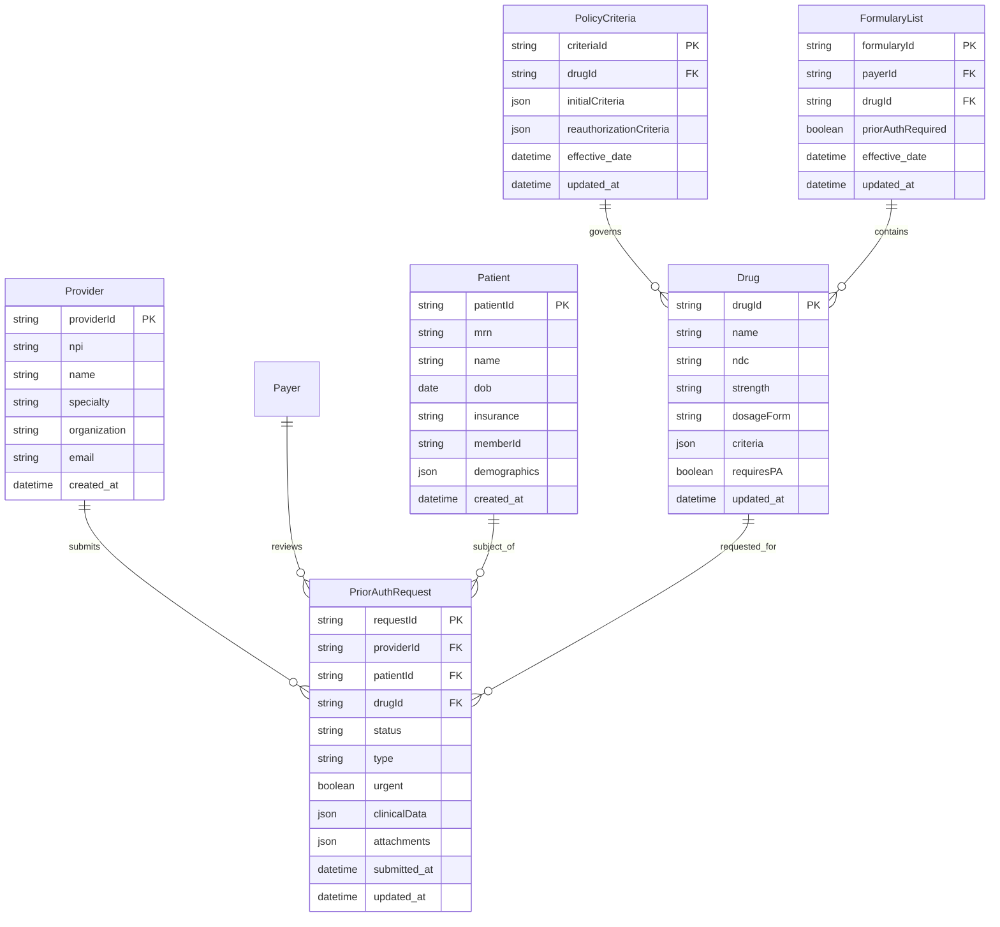

### 6.1.2 Supporting Entities

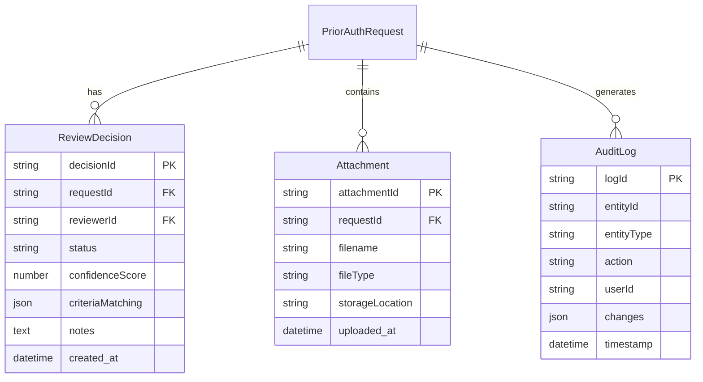

## 6.2 Data Storage

### 6.2.1 Primary Storage
- **Transactional Data**: Amazon RDS (Multi-AZ) for HIPAA-compliant relational data
- **Document Storage**: Amazon S3 with server-side encryption for attachments
- **Cache Layer**: Amazon ElastiCache for session and frequently accessed data

### 6.2.2 Data Retention
- Active PA requests: Indefinite retention in primary storage
- Completed PA requests: 7-year retention per HIPAA requirements
- Audit logs: 7-year minimum retention
- Attachments: 7-year retention with lifecycle policies

### 6.2.3 Backup & Recovery
- **Automated Backups**:
  - RDS: Daily full backups with 5-minute transaction logs
  - S3: Cross-region replication
  - Point-in-time recovery capability for 35 days

- **Disaster Recovery**:
  - Multi-AZ deployment for immediate failover
  - Cross-region backup copies
  - RPO: 15 minutes
  - RTO: 1 hour

## 6.3 Data Processing

### 6.3.1 Data Security

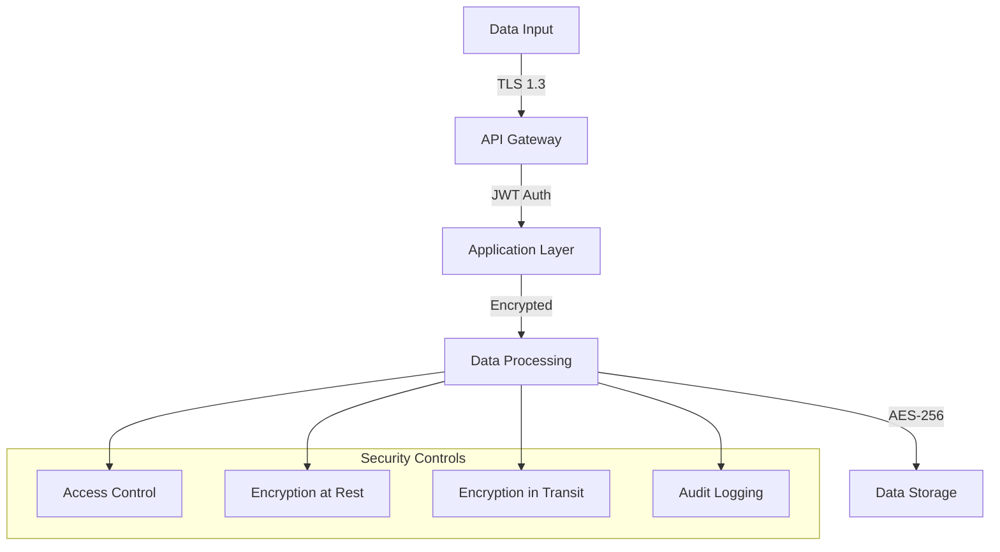

### 6.3.2 Data Flow

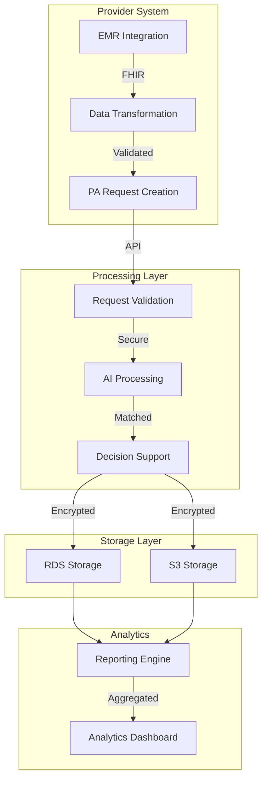

### 6.3.3 Data Integration
- FHIR R4 compliance for all healthcare data exchange
- Da Vinci implementation guides for PA workflows
- Real-time EMR integration via FHIR APIs
- Batch processing for formulary and policy updates
- Event-driven architecture for notifications and updates

# 7. EXTERNAL INTERFACES

## 7.1 User Interfaces

### 7.1.1 Provider Portal Interface

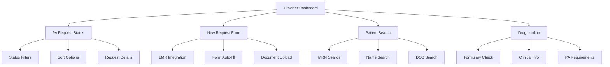

Key Requirements:
- Responsive design supporting 1024x768 minimum resolution
- WCAG 2.1 Level AA compliance
- Support for latest versions of Chrome, Firefox, Safari, Edge
- Maximum 3-second load time for main dashboard
- Touch-friendly interface for tablet use

### 7.1.2 Payer Portal Interface

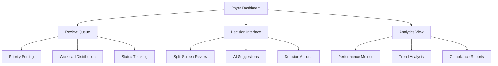

Key Requirements:
- Dual-monitor support for review interface
- Real-time status updates
- Keyboard shortcuts for common actions
- Customizable workspace layouts
- Integrated document viewer

## 7.2 Hardware Interfaces

### 7.2.1 Document Scanner Integration
- TWAIN protocol support
- Minimum 300 DPI scanning resolution
- PDF/A format output
- Automatic image enhancement
- Multi-page document support

### 7.2.2 Signature Capture Devices
- USB HID compliance
- Minimum 1000 DPI resolution
- Real-time signature rendering
- Pressure sensitivity support
- Digital certificate integration

## 7.3 Software Interfaces

### 7.3.1 EMR Integration

| System | Protocol | Data Format | Authentication |
|--------|----------|-------------|----------------|
| EPIC | FHIR R4 | JSON | OAuth 2.0 |
| Cerner | FHIR R4 | JSON | JWT |
| Allscripts | FHIR R4 | JSON | SAML 2.0 |

### 7.3.2 External Services

| Service | Purpose | Integration Method | SLA |
|---------|---------|-------------------|-----|
| Drug Database | Formulary verification | REST API | 99.9% |
| Policy Database | Criteria lookup | GraphQL | 99.9% |
| Claude 3.5 | AI processing | REST API | 99.5% |
| AWS Services | Infrastructure | Native SDK | 99.99% |

## 7.4 Communication Interfaces

### 7.4.1 Network Protocols

| Protocol | Usage | Security |
|----------|--------|----------|
| HTTPS | Web traffic | TLS 1.3 |
| WebSocket | Real-time updates | WSS |
| SFTP | Batch file transfer | SSH keys |
| HL7 FHIR | Healthcare data | OAuth 2.0 |

### 7.4.2 Integration Patterns

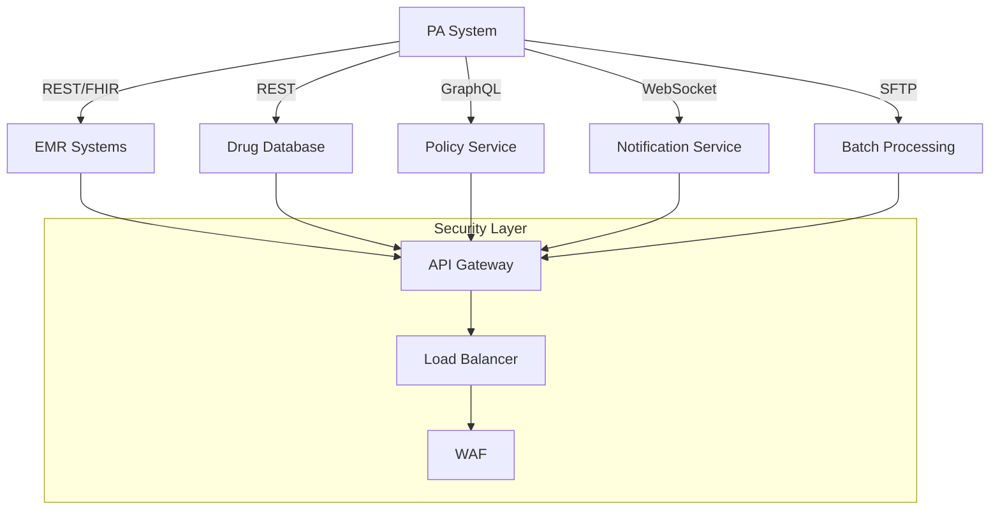

### 7.4.3 Message Formats

| Interface | Format | Schema | Validation |
|-----------|--------|---------|------------|
| API Requests | JSON | OpenAPI 3.0 | JSON Schema |
| Healthcare Data | FHIR R4 | StructureDefinition | FHIR Validator |
| Batch Files | CSV/XML | XSD | Schematron |
| Events | JSON | AsyncAPI | JSON Schema |

# APPENDICES

## A. GLOSSARY

| Term | Definition |
|------|------------|
| Prior Authorization (PA) | A requirement from insurance companies to approve coverage of certain medications before they are prescribed |
| Formulary | A list of prescription drugs covered by a health insurance plan |
| Policy Criteria | Specific requirements that must be met for a drug to be approved for coverage |
| Clinical Decision Support | Tools that provide clinicians with knowledge and patient-specific information to enhance healthcare decisions |
| Reauthorization | The process of renewing an existing prior authorization that is expiring |
| Evidence Matching | The process of comparing patient clinical data against policy criteria requirements |

## B. ACRONYMS

| Acronym | Full Form |
|---------|-----------|
| PA | Prior Authorization |
| EMR | Electronic Medical Record |
| FHIR | Fast Healthcare Interoperability Resources |
| API | Application Programming Interface |
| LLM | Large Language Model |
| HIPAA | Health Insurance Portability and Accountability Act |
| MFA | Multi-Factor Authentication |
| JWT | JSON Web Token |
| REST | Representational State Transfer |
| UHC | UnitedHealthcare |
| RAG | Retrieval Augmented Generation |
| RPO | Recovery Point Objective |
| RTO | Recovery Time Objective |

## C. ADDITIONAL REFERENCES

### Healthcare Standards
- FHIR R4 Implementation Guide: `https://hl7.org/fhir/R4/`
- Da Vinci Prior Authorization Implementation Guide: `http://hl7.org/fhir/us/davinci-pa/`
- HIPAA Security Rule Requirements: `https://www.hhs.gov/hipaa/for-professionals/security/`

### Technical Resources
- AWS Healthcare Compliance: `https://aws.amazon.com/compliance/hipaa-compliance/`
- Claude API Documentation: `https://docs.anthropic.com/claude/`
- React.js Best Practices: `https://reactjs.org/docs/`

### Sample Forms & Policies
- UHC Prior Authorization Forms:
  - General PA Form: `https://www.uhcprovider.com/content/dam/provider/docs/public/prior-auth/exchanges/General-Prior-Auth-Form-UHC-Exchange.pdf`
  - Massachusetts Drug PA Form: `https://www.uhcprovider.com/content/dam/provider/docs/public/prior-auth/drugs-pharmacy/MA-COMM-Prescription-Prior-Auth-Form.pdf`
- UHC Drug Policies:
  - Sample Policy Document: `https://www.uhcprovider.com/content/dam/provider/docs/public/prior-auth/drugs-pharmacy/commercial/a-g/PA-Med-Nec-Abilify-Mycite.pdf`
  - Commercial Formulary: `https://www.uhcprovider.com/content/dam/provider/docs/public/resources/pharmacy/Commerical-PDL-Eff-Jan-2024.pdf`

## D. SYSTEM ARCHITECTURE DIAGRAM

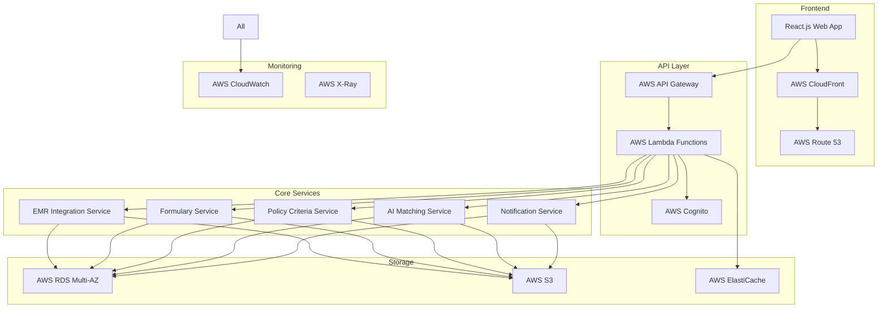