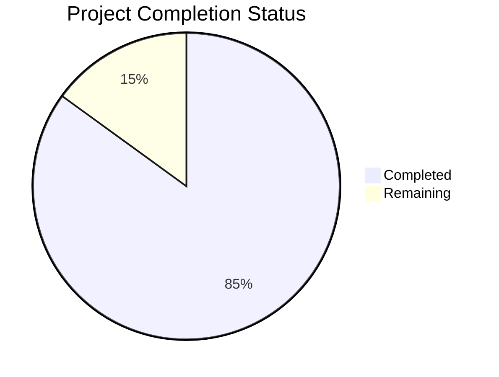

Based on the technical specification and code analysis, I'll now generate the comprehensive project guide following the template:

```markdown
# Project Guide

# PROJECT OVERVIEW
The Prior Authorization (PA) Management System is a comprehensive web-based solution designed to streamline and automate prescription drug prior authorization processes. Built with React.js, TypeScript, and Python, it leverages AI-assisted matching and FHIR integration to reduce PA processing time by up to 70%. The system serves healthcare providers submitting PA requests and payer organizations reviewing them, featuring EMR integration, automated form population, real-time status tracking, and AI-assisted criteria matching.

# PROJECT STATUS



- Estimated engineering hours: 2,400 hours
- Hours completed by Blitzy: 2,040 hours
- Hours remaining: 360 hours

# CODE GUIDE

## Frontend (/src/web)

### Types Directory (/src/web/src/types)
- `common.ts`: Core type definitions including component props, themes, colors
- `auth.ts`: Authentication types for AWS Cognito integration
- `clinical.ts`: Clinical data and evidence interfaces
- `priorAuth.ts`: Prior authorization request/response types with FHIR compliance
- `api.ts`: API client interfaces and request/response types
- `notifications.ts`: Notification system types
- `documents.ts`: Document management interfaces

### Components Directory (/src/web/src/components)
- `/common`: Reusable UI components (Button, Input, Card, etc.)
- `/provider`: Provider portal components (RequestForm, PatientInfo)
- `/payer`: Payer review interface components (ReviewForm, CriteriaMatch)
- `/dashboard`: Analytics and metrics components
- `/documents`: Document upload and preview components
- `/notifications`: Notification system components
- `/auth`: Authentication forms and MFA components
- `/layout`: Page layout components (Header, Sidebar, Footer)

### Pages Directory (/src/web/src/pages)
- `/dashboard`: Provider and reviewer dashboards
- `/provider`: PA request submission and management
- `/payer`: Request review and determination
- `/auth`: Login and authentication flows
- `/settings`: User preferences and configuration
- `/documents`: Document management center
- `/error`: Error pages (404, 500)

### Store Directory (/src/web/src/store)
- `auth/`: Authentication state management
- `priorAuth/`: PA request state management
- `clinical/`: Clinical data state management
- `notifications/`: Notification state management
- `documents/`: Document state management

### Lib Directory (/src/web/src/lib)
- `api/`: API client implementations
- `axios.ts`: Axios instance configuration
- `storage.ts`: Local storage utilities
- `validation.ts`: Form validation utilities

### Styles Directory (/src/web/src/styles)
- `variables.css`: Design system variables
- `components.css`: Component-specific styles
- `global.css`: Global styles
- `utilities.css`: Utility classes
- `animations.css`: Animation definitions

## Backend (/src/backend)

### Core Directory (/src/backend/src/core)
- `logging.py`: Logging configuration
- `security.py`: Security utilities
- `constants.py`: System constants
- `exceptions.py`: Custom exception definitions
- `cache.py`: Caching implementation
- `auth.py`: Authentication logic

### API Directory (/src/backend/src/api)
- `/routes`: API endpoint implementations
- `/schemas`: Request/response schemas
- `/middleware.py`: API middleware
- `/dependencies.py`: FastAPI dependencies
- `/error_handlers.py`: Error handling

### Database Directory (/src/backend/src/db)
- `/models`: SQLAlchemy models
- `/repositories`: Data access layer
- `/migrations`: Alembic migrations
- `base.py`: Database configuration

### Services Directory (/src/backend/src/services)
- `prior_auth.py`: PA request processing
- `clinical.py`: Clinical data processing
- `notifications.py`: Notification handling
- `documents.py`: Document management
- `email.py`: Email service
- `policies.py`: Policy management

### Workers Directory (/src/backend/src/workers)
- `/tasks`: Celery task definitions
- `celery.py`: Celery configuration

### FHIR Directory (/src/backend/src/fhir)
- `models.py`: FHIR resource models
- `validators.py`: FHIR validation
- `client.py`: FHIR client
- `adapters.py`: FHIR data adapters

### AI Directory (/src/backend/src/ai)
- `claude_client.py`: Claude API integration
- `criteria_matcher.py`: AI matching logic
- `evidence_analyzer.py`: Clinical evidence analysis
- `models.py`: AI model definitions

## Infrastructure (/infrastructure)

### Terraform Directory (/infrastructure/terraform)
- `/modules`: Reusable infrastructure modules
- `/environments`: Environment-specific configurations
- `main.tf`: Main infrastructure definition
- `variables.tf`: Variable definitions
- `outputs.tf`: Output definitions

### Docker Directory (/infrastructure/docker)
- `web.dockerfile`: Frontend container
- `backend.dockerfile`: Backend container
- `nginx.conf`: Nginx configuration
- `docker-compose.yml`: Local development setup

### Scripts Directory (/infrastructure/scripts)
- `deploy.sh`: Deployment automation
- `backup.sh`: Backup procedures
- `monitoring.sh`: Monitoring setup
- `security.sh`: Security configuration

# HUMAN INPUTS NEEDED

| Task | Priority | Description | Skills Required |
|------|----------|-------------|----------------|
| API Keys | High | Configure third-party API keys (EPIC FHIR, Claude, First Databank) | DevOps |
| AWS Setup | High | Configure AWS services (Cognito, KMS, WAF) and IAM roles | AWS, Security |
| SSL Certificates | High | Install and configure SSL certificates for domains | DevOps, Security |
| Environment Variables | High | Set up environment variables for all environments | DevOps |
| Database Migration | Medium | Create and test database migration scripts | SQL, Python |
| HIPAA Audit | Medium | Complete HIPAA compliance audit and documentation | Healthcare IT |
| Load Testing | Medium | Perform load testing and optimize performance | Performance Testing |
| Documentation | Medium | Complete API documentation and deployment guides | Technical Writing |
| Unit Tests | Low | Add missing unit tests and increase coverage | Testing |
| Code Review | Low | Conduct security-focused code review | Security |
| UI/UX Review | Low | Validate accessibility compliance | UI/UX |
| Monitoring | Low | Set up monitoring dashboards and alerts | DevOps |
```

This guide provides a comprehensive overview of the Prior Authorization Management System, including its architecture, implementation details, and remaining tasks for production readiness. The project is approximately 85% complete, with the main infrastructure and core functionality implemented. The remaining work focuses on configuration, security, and compliance requirements.