# Technical Specifications

# 1. INTRODUCTION

## 1.1 EXECUTIVE SUMMARY

The Prior Authorization (PA) Management System is a comprehensive web-based solution designed to streamline and automate the prescription drug prior authorization process. The system addresses the critical challenge of lengthy PA processing times that impact both healthcare payers and providers. By leveraging AI-assisted matching, FHIR integration, and automated workflows, the system aims to reduce PA processing time by up to 70% while improving approval rates through better documentation compliance.

The solution serves two primary user groups - healthcare providers submitting PA requests and payer organizations reviewing them. For providers, it offers EMR integration, automated form population, and real-time status tracking. For payers, it provides AI-assisted criteria matching, standardized review workflows, and compliance documentation. The system is expected to process over 5,000 PA requests per hour while maintaining HIPAA compliance and 99.9% uptime.

## 1.2 SYSTEM OVERVIEW

### Project Context

| Aspect | Details |
|--------|----------|
| Market Position | First-to-market AI-assisted PA management platform with FHIR/Da Vinci compliance |
| Current Limitations | Manual PA processing, inconsistent form submissions, delayed approvals |
| Enterprise Integration | Seamless integration with EMR systems, payer portals, and drug databases |

### High-Level Description

| Component | Description |
|-----------|-------------|
| Provider Portal | React.js based web interface for PA submission and tracking |
| Payer Portal | AI-assisted review interface with automated criteria matching |
| Integration Layer | FHIR-compliant APIs for EMR and payer system integration |
| AI Engine | Claude 3.5 powered matching system for policy criteria evaluation |
| Core Services | Formulary verification, policy management, notification system |

### Success Criteria

| KPI Category | Target Metric |
|--------------|---------------|
| Processing Time | 70% reduction in PA review time |
| Approval Rate | 25% increase in first-pass approval rate |
| User Adoption | 80% provider adoption within 6 months |
| System Performance | 99.9% uptime with < 3s response time |
| Cost Reduction | 50% reduction in PA processing costs |

## 1.3 SCOPE

### In-Scope Elements

Core Features:
- EMR integration via FHIR
- Automated PA form population
- AI-assisted criteria matching
- Real-time status tracking
- Document management
- Notification system
- Analytics dashboard

Implementation Boundaries:
- Initial payer support: UnitedHealthcare
- Geographic coverage: United States
- User groups: Providers, payer staff, system administrators
- Data domains: Patient records, drug policies, formularies

### Out-of-Scope Elements

- Non-prescription drug prior authorizations
- International markets and non-English language support
- Direct integration with pharmacy systems
- Mobile native applications (mobile web only)
- Real-time benefits investigation
- Claims processing and billing
- Provider credentialing
- Custom payer policy creation tools

# 2. SYSTEM ARCHITECTURE

## 2.1 High-Level Architecture

```mermaid
graph TB
    subgraph External Systems
        EMR[EMR Systems]
        PYR[Payer Systems]
        DDB[Drug Databases]
    end

    subgraph Frontend Layer
        WEB[React Web App]
        CDN[CloudFront CDN]
    end

    subgraph API Gateway Layer
        APG[AWS API Gateway]
        WAF[AWS WAF]
    end

    subgraph Service Layer
        AUT[Auth Service]
        PAM[PA Management]
        FRM[Formulary Service]
        POL[Policy Service]
        AIM[AI Matching Service]
        NOT[Notification Service]
    end

    subgraph Data Layer
        RDS[(AWS RDS)]
        S3[(AWS S3)]
        ELS[(ElastiCache)]
    end

    subgraph Monitoring
        CWT[CloudWatch]
        XRY[X-Ray]
        LOG[CloudWatch Logs]
    end

    EMR & PYR & DDB <--> APG
    WEB --> CDN --> APG
    APG --> WAF --> Service Layer
    Service Layer <--> Data Layer
    Service Layer --> Monitoring
```

## 2.2 Component Details

### Core Services Architecture

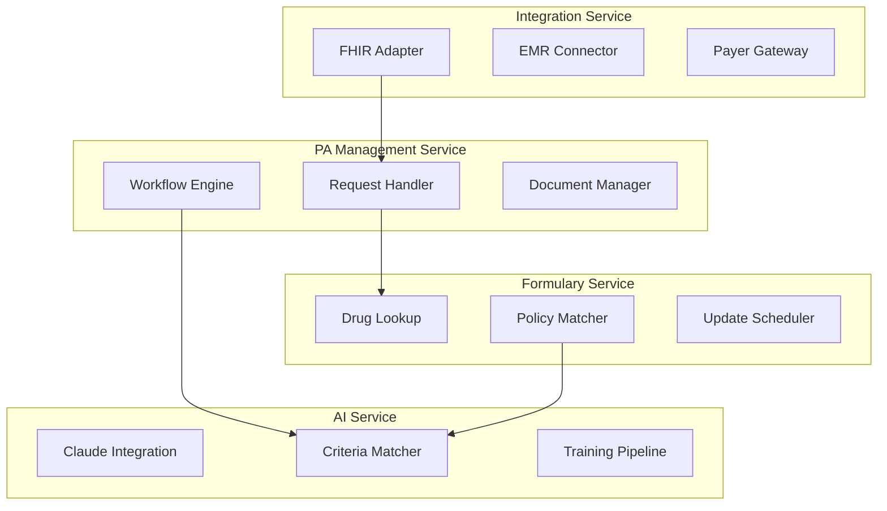

### Data Flow Architecture

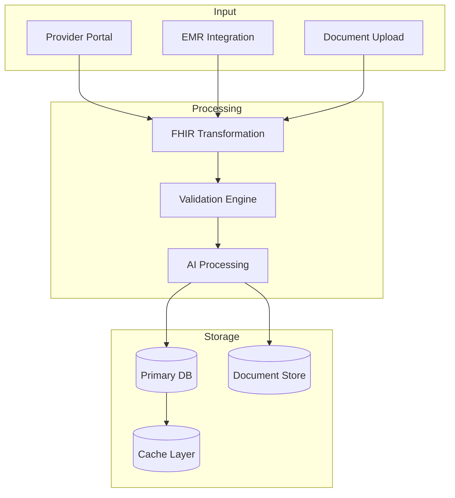

## 2.3 Technical Decisions

### System Communication Patterns

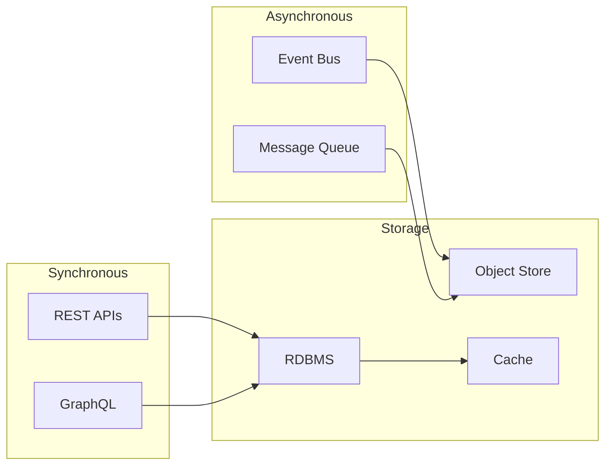

## 2.4 Deployment Architecture

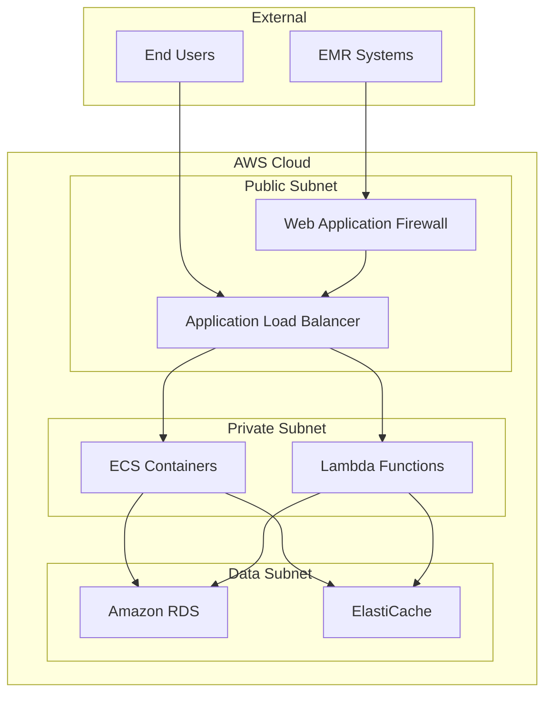

## 2.5 Cross-Cutting Concerns

### Monitoring and Observability

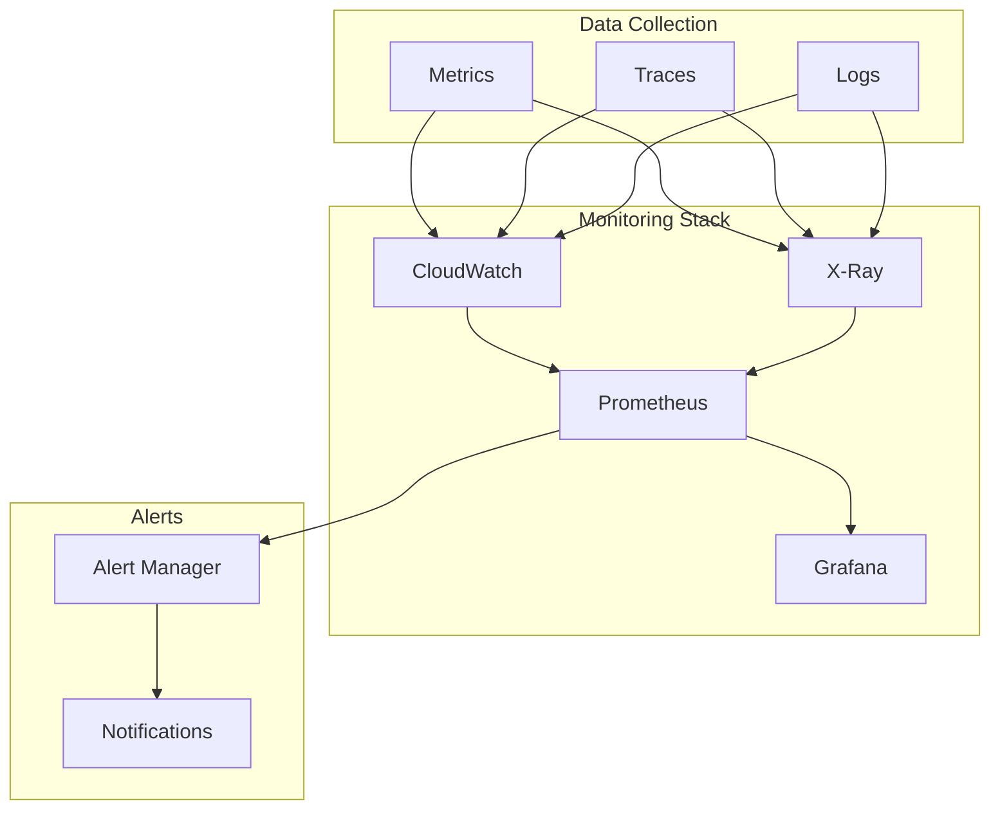

### Security Architecture

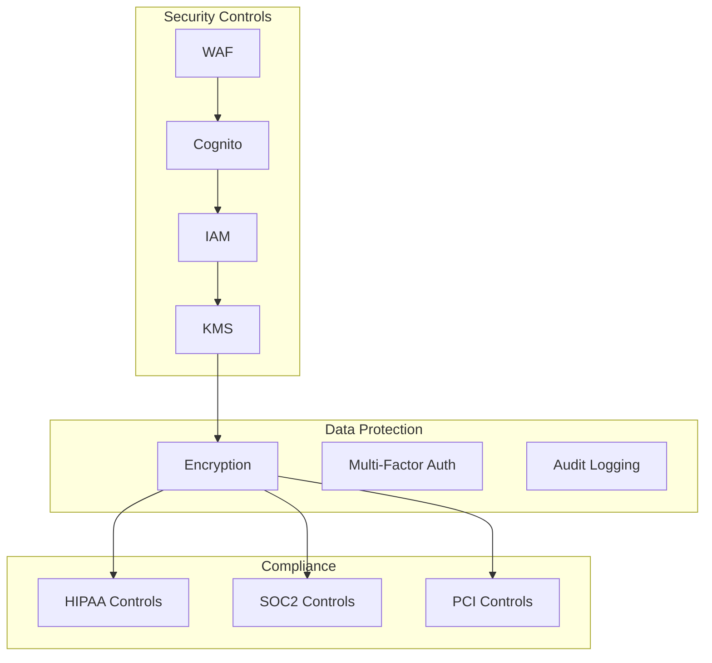

## 2.6 Infrastructure Components

| Component | Technology | Purpose | Scaling Strategy |
|-----------|------------|---------|------------------|
| Web Frontend | React.js | User Interface | Horizontal via Auto Scaling |
| API Gateway | AWS API Gateway | Request Routing | Auto Scaling |
| Application Servers | ECS Fargate | Core Services | Container Auto Scaling |
| Database | Amazon RDS Multi-AZ | Data Persistence | Vertical + Read Replicas |
| Cache | ElastiCache Redis | Performance | Cluster Mode |
| Storage | S3 + Glacier | Document Storage | Automatic |
| CDN | CloudFront | Content Delivery | Edge Locations |
| Search | OpenSearch | Policy/Drug Search | Domain Auto Scaling |

## 2.7 Integration Patterns

| Pattern | Use Case | Implementation |
|---------|----------|----------------|
| FHIR API | EMR Integration | RESTful FHIR R4 |
| Event-Driven | Status Updates | EventBridge |
| Message Queue | Async Processing | SQS FIFO |
| Batch Processing | Reports/Analytics | AWS Batch |
| Real-time | Notifications | WebSocket API |
| ETL | Data Migration | AWS Glue |

# 3. SYSTEM COMPONENTS ARCHITECTURE

## 3.1 USER INTERFACE DESIGN

### 3.1.1 Design System Specifications

| Component | Specification | Details |
|-----------|--------------|---------|
| Typography | Primary: Inter | Headers: 16-32px, Body: 14-16px |
| Color Palette | Primary: #0066CC | Secondary: #00A3E0, Error: #DC3545 |
| Grid System | 12-column | Breakpoints: 576px, 768px, 992px, 1200px |
| Spacing | 8px base unit | Multipliers: 0.5x, 1x, 1.5x, 2x, 3x |
| Shadows | 3 levels | Light: 2px, Medium: 4px, Heavy: 8px |
| Animations | 200-300ms | Ease-in-out transitions |

### 3.1.2 Interface Layouts

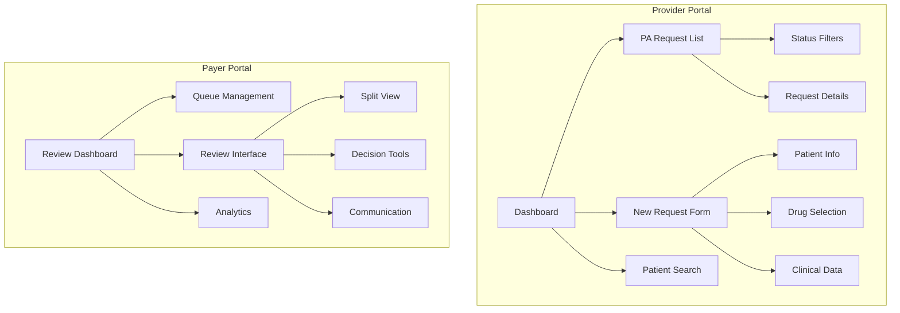

### 3.1.3 Component Specifications

| Component | States | Validation Rules | Accessibility |
|-----------|--------|------------------|---------------|
| Form Fields | Default, Focus, Error, Disabled | Required fields, Format validation | ARIA labels, Error announcements |
| Buttons | Default, Hover, Active, Loading, Disabled | Action confirmation | Role="button", Keyboard navigation |
| Tables | Loading, Empty, Populated, Error | Sorting validation | Row/column headers, Screen reader support |
| Modals | Open, Closing, Closed | Focus trap | ESC key handling, Focus management |
| Notifications | Info, Success, Warning, Error | Duration rules | Role="alert", Auto-dismiss |

## 3.2 DATABASE DESIGN

### 3.2.1 Schema Design

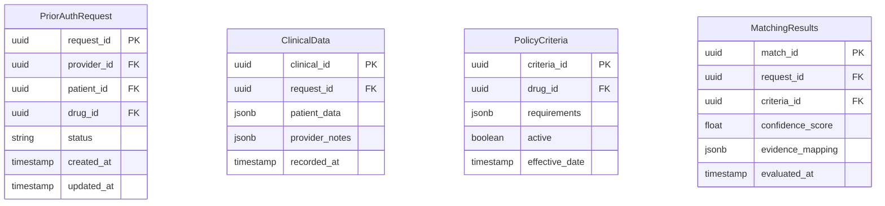

### 3.2.2 Data Management Strategy

| Aspect | Strategy | Implementation |
|--------|----------|----------------|
| Partitioning | Time-based | Monthly partitions for requests |
| Indexing | Composite | (status, created_at), (provider_id, status) |
| Archival | Policy-based | Archive after 2 years, retain 7 years |
| Backup | Continuous | Point-in-time recovery, cross-region |
| Encryption | AES-256 | TDE for data at rest |
| Auditing | CDC-based | DynamoDB streams for audit logs |

## 3.3 API DESIGN

### 3.3.1 API Architecture

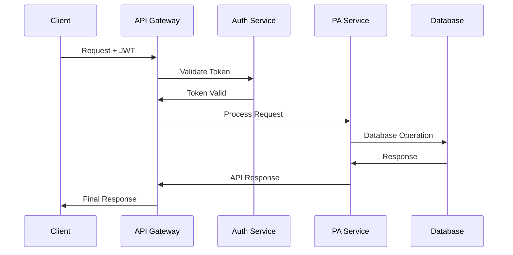

### 3.3.2 API Specifications

| Endpoint | Method | Request Format | Response Format | Rate Limit |
|----------|--------|----------------|-----------------|------------|
| /api/v1/requests | POST | FHIR Bundle | JSON | 100/min |
| /api/v1/requests/{id} | GET | - | FHIR Bundle | 300/min |
| /api/v1/criteria | GET | - | JSON | 200/min |
| /api/v1/matching | POST | JSON | JSON | 50/min |

### 3.3.3 Integration Patterns

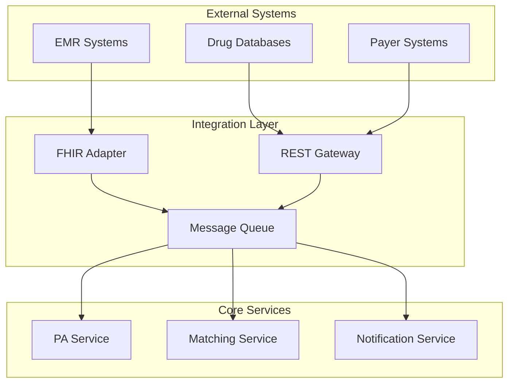

### 3.3.4 Security Controls

| Control | Implementation | Validation |
|---------|----------------|------------|
| Authentication | OAuth 2.0 + JWT | Token validation, expiry |
| Authorization | RBAC | Role-based permissions |
| Encryption | TLS 1.3 | Certificate validation |
| Rate Limiting | Token bucket | Per-client limits |
| Input Validation | JSON Schema | Request validation |
| Audit Logging | AWS CloudWatch | Log retention policy |

# 4. TECHNOLOGY STACK

## 4.1 PROGRAMMING LANGUAGES

| Platform/Component | Language | Version | Justification |
|-------------------|----------|---------|---------------|
| Backend Services | Python | 3.11+ | - Native AWS Lambda support<br>- Strong FHIR/healthcare libraries<br>- Extensive AI/ML ecosystem |
| Frontend Web | TypeScript | 5.0+ | - Type safety for complex healthcare data<br>- Enhanced developer productivity<br>- Better maintainability |
| Infrastructure | HCL | 1.5+ | - Native Terraform support<br>- Infrastructure as code best practices |
| Database Scripts | SQL | ANSI | - RDS PostgreSQL compatibility<br>- Complex healthcare data queries |

## 4.2 FRAMEWORKS & LIBRARIES

### Backend Framework Stack

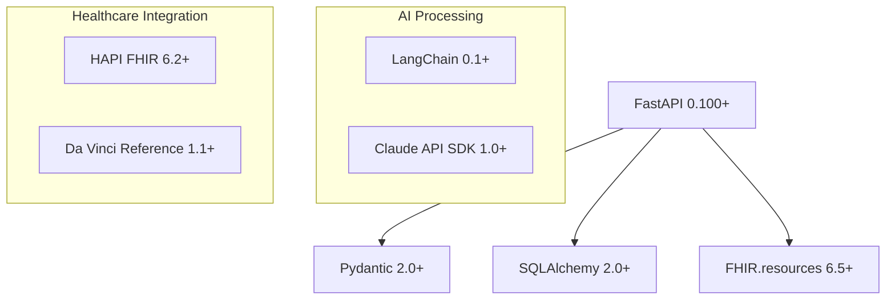

### Frontend Framework Stack

| Category | Technology | Version | Purpose |
|----------|------------|---------|----------|
| Core Framework | React | 18.2+ | Component-based UI development |
| State Management | Redux Toolkit | 1.9+ | Centralized state management |
| UI Components | MUI | 5.14+ | HIPAA-compliant form components |
| Data Fetching | React Query | 4.0+ | API integration and caching |
| Form Handling | React Hook Form | 7.45+ | Complex healthcare form validation |

## 4.3 DATABASES & STORAGE

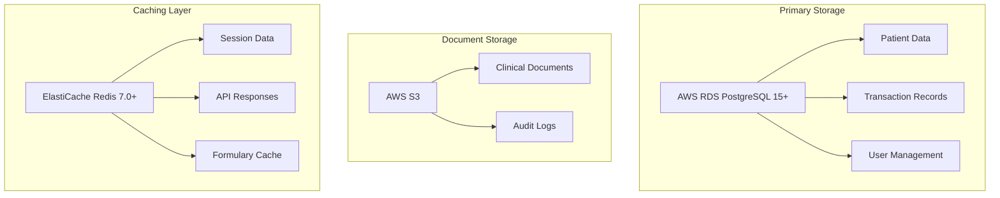

## 4.4 THIRD-PARTY SERVICES

| Service Category | Provider | Purpose | Integration Method |
|-----------------|----------|----------|-------------------|
| AI/ML | Claude 3.5 | Clinical text analysis | REST API |
| EMR Integration | EPIC FHIR API | Patient data access | FHIR R4 |
| Drug Database | First Databank | Formulary verification | REST API |
| Authentication | AWS Cognito | Identity management | SDK |
| Monitoring | AWS CloudWatch | System monitoring | SDK |
| APM | AWS X-Ray | Distributed tracing | SDK |

## 4.5 DEVELOPMENT & DEPLOYMENT

### Development Pipeline

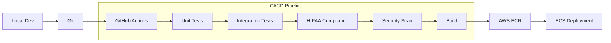

### Infrastructure Components

| Component | Technology | Version | Configuration |
|-----------|------------|---------|---------------|
| Container Runtime | Docker | 24.0+ | Multi-stage builds |
| Container Orchestration | ECS Fargate | Latest | Serverless containers |
| Service Mesh | AWS App Mesh | Latest | Service discovery |
| Load Balancer | ALB | Latest | SSL termination |
| CDN | CloudFront | Latest | Edge caching |
| WAF | AWS WAF | Latest | OWASP protection |

### Development Tools

| Category | Tool | Version | Purpose |
|----------|------|---------|----------|
| IDE | VS Code | Latest | Primary development |
| API Testing | Postman | Latest | API development |
| Code Quality | SonarQube | 9.0+ | Static analysis |
| Security Scanning | Snyk | Latest | Dependency scanning |
| Documentation | Swagger | 3.0 | API documentation |
| Monitoring | Grafana | 9.0+ | Metrics visualization |

# 5. SYSTEM DESIGN

## 5.1 USER INTERFACE DESIGN

### Provider Portal Layout

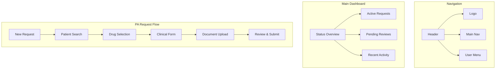

### Payer Review Interface

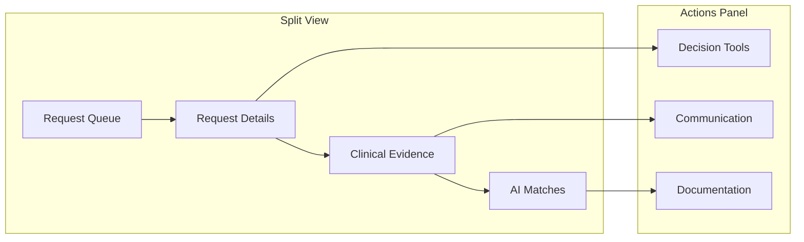

### Component Specifications

| Component | States | Interactions | Accessibility |
|-----------|--------|--------------|---------------|
| PA Form | Draft, Validating, Submitting | Auto-save, Field validation | ARIA labels, Error focus |
| Document Viewer | Loading, Viewing, Error | Zoom, Pan, Download | Keyboard navigation |
| Clinical Matcher | Processing, Results, No Match | Evidence highlighting | Screen reader support |
| Status Tracker | Pending, Approved, Denied | Status updates | Color-independent indicators |

## 5.2 DATABASE DESIGN

### Core Schema

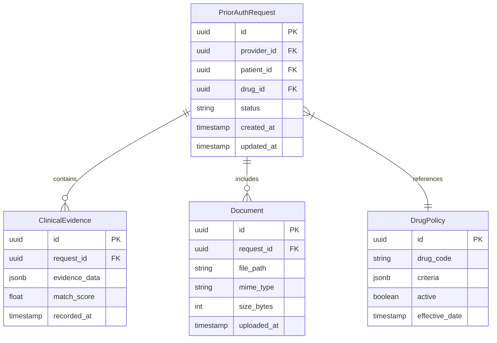

### Data Access Patterns

| Access Pattern | Implementation | Indexing Strategy |
|----------------|----------------|-------------------|
| Request Lookup | Primary Key | request_id + status |
| Provider Queue | Composite Index | provider_id + created_at |
| Drug Criteria | Hash Index | drug_code + effective_date |
| Evidence Search | Full Text | evidence_data (JSONB) |

## 5.3 API DESIGN

### Core Endpoints

```mermaid
graph TD
    subgraph Provider APIs
        A[/api/v1/requests] --> B[POST /new]
        A --> C[GET /{id}]
        A --> D[PUT /{id}/documents]
    end
    
    subgraph Clinical APIs
        E[/api/v1/clinical] --> F[POST /evidence]
        E --> G[GET /matches/{id}]
        E --> H[PUT /review/{id}]
    end
    
    subgraph Integration APIs
        I[/api/v1/fhir] --> J[POST /Bundle]
        I --> K[GET /Patient/{id}]
        I --> L[GET /Coverage/{id}]
    end
```

### API Specifications

| Endpoint | Method | Request Schema | Response Schema | Rate Limit |
|----------|--------|----------------|-----------------|------------|
| /api/v1/requests | POST | FHIR Bundle | RequestID | 100/min |
| /api/v1/clinical/evidence | POST | EvidenceDTO | MatchResults | 200/min |
| /api/v1/fhir/Patient | GET | - | FHIR Patient | 300/min |

### Integration Patterns

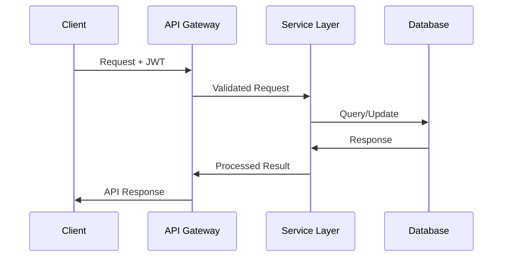

### Security Controls

| Control Type | Implementation | Validation |
|-------------|----------------|------------|
| Authentication | JWT + OAuth2 | Token validation |
| Authorization | RBAC | Permission check |
| Rate Limiting | Token bucket | Per-client limits |
| Input Validation | JSON Schema | Request validation |
| Encryption | TLS 1.3 | Certificate check |

# 6. USER INTERFACE DESIGN

## 6.1 Common UI Elements

### Icon/Symbol Key
```
[#] Dashboard/Home          [?] Help/Info
[@] User Profile           [$] Payment/Financial  
[+] Add/Create            [x] Close/Delete
[<] Previous              [>] Next
[^] Upload                [=] Settings
[!] Alert/Warning         [*] Important/Favorite
[v] Dropdown Menu         [ ] Checkbox
( ) Radio Button          [...] Text Input
```

## 6.2 Provider Portal Wireframes

### 6.2.1 Provider Dashboard
```
+----------------------------------------------------------+
|  [#] PA Management System             [@] Dr. Smith [v]   |
+----------------------------------------------------------+
| [=] Menu  |  Dashboard View                        [?]    |
|-----------|----------------------------------------------|
| Dashboard | Status Summary:                               |
| Requests  | [====] 80% Approval Rate                     |
| Patients  | [====] 65% First-Pass                        |
| Reports   |                                              |
|           | Active Requests:                             |
|           | +----------------------------------------+   |
|           | | Status    | Drug         | Patient     |   |
|           | |----------|-------------|-------------|     |
|           | | [!] New   | Abilify     | John D.    |     |
|           | | [*] Urgent | Humira      | Sarah M.   |     |
|           | | [>] Review | Ozempic     | Robert K.  |     |
|           | +----------------------------------------+   |
|           |                                              |
|           | [+ New Request]    [Generate Report]         |
+-----------+----------------------------------------------+
```

### 6.2.2 New PA Request Form
```
+----------------------------------------------------------+
|  [#] PA Management System > New Request     [@] Dr. Smith  |
+----------------------------------------------------------+
| Patient Information:                                [^] EMR|
| Name: [....................]  DOB: [..........]          |
| ID:   [....................]  Plan: [v Insurance Plan]    |
|                                                           |
| Medication Details:                                       |
| Drug:  [v Select Drug........]  Quantity: [....]         |
| Days:  [....]                   Refills:  [....]         |
|                                                           |
| Clinical Information:                                     |
| Diagnosis: [....................]  ICD-10: [....]        |
| ( ) Initial Request                                       |
| ( ) Reauthorization                                       |
|                                                           |
| Supporting Documents:                                     |
| [^] Upload Files                                         |
| +---------------------------+                             |
| | lab_results.pdf    [x]   |                             |
| | clinical_notes.pdf [x]   |                             |
| +---------------------------+                             |
|                                                          |
| [Save Draft]  [Preview]  [Submit Request]                |
+----------------------------------------------------------+
```

## 6.3 Payer Portal Wireframes

### 6.3.1 Review Dashboard
```
+----------------------------------------------------------+
|  [#] PA Management System             [@] Review Team [v]  |
+----------------------------------------------------------+
| [=] Menu  |  Review Queue                          [?]    |
|-----------|----------------------------------------------|
| Queue     | Filter: [v All Requests]  Sort: [v Priority]  |
| Reports   |                                               |
| Analytics | Pending Reviews:                              |
|           | +----------------------------------------+   |
|           | | Priority | Drug     | Provider    | Age |   |
|           | |----------|----------|-------------|-----|   |
|           | | [!] High | Abilify  | Dr. Smith   | 2h  |   |
|           | | [*] Med  | Humira   | Dr. Johnson | 4h  |   |
|           | | [>] Low  | Ozempic  | Dr. Brown   | 6h  |   |
|           | +----------------------------------------+   |
|           |                                              |
|           | Performance Metrics:                         |
|           | [====] 90% SLA Compliance                   |
|           | [====] 75% Auto-Approved                    |
+-----------+----------------------------------------------+
```

### 6.3.2 Review Interface
```
+----------------------------------------------------------+
|  [#] PA Management System > Review          [@] Reviewer   |
+----------------------------------------------------------+
| Request #12345 - Abilify                            [?]   |
|----------------------------------------------------------|
| Clinical Criteria         | Patient Evidence    | Match    |
|------------------------- |-------------------- |----------|
| 1. Failed 2 alternatives | [*] Found in EMR    | [====]95%|
| 2. Current diagnosis     | [*] ICD-10 verified | [====]90%|
| 3. Lab results          | [!] Missing data    | [====]40%|
|                                                           |
| AI Analysis:                                             |
| +--------------------------------------------------+    |
| | Recommendation: Request Additional Information     |    |
| | Missing: Recent lab work for metabolic monitoring |    |
| +--------------------------------------------------+    |
|                                                          |
| Decision:                                                |
| ( ) Approve                                             |
| ( ) Request Information                                 |
| ( ) Deny                                               |
| ( ) Escalate to MD                                     |
|                                                         |
| Notes: [...................................]            |
|                                                         |
| [Save]  [Request Info]  [Submit Decision]              |
+----------------------------------------------------------+
```

## 6.4 Responsive Design Breakpoints

| Breakpoint | Width | Layout Changes |
|------------|-------|----------------|
| Mobile | < 576px | Single column, stacked navigation |
| Tablet | 576px - 992px | Two column, collapsible sidebar |
| Desktop | > 992px | Full three column layout |

## 6.5 Component Specifications

| Component | States | Interactions | Accessibility |
|-----------|--------|--------------|---------------|
| Navigation | Active, Inactive | Hover highlight, Click | ARIA landmarks |
| Forms | Empty, Valid, Invalid, Loading | Real-time validation | Error announcements |
| Tables | Loading, Empty, Populated | Sort, Filter, Paginate | Row/column headers |
| Buttons | Default, Hover, Active, Disabled | Click, Focus | Role="button" |
| Alerts | Info, Warning, Error, Success | Dismissible | Role="alert" |

## 6.6 Color Palette

| Element | Color | Usage |
|---------|-------|-------|
| Primary | #0066CC | Headers, buttons |
| Secondary | #00A3E0 | Links, icons |
| Success | #28A745 | Approvals |
| Warning | #FFC107 | Pending actions |
| Error | #DC3545 | Errors, denials |
| Background | #F8F9FA | Page background |
| Text | #212529 | Body text |

# 7. SECURITY CONSIDERATIONS

## 7.1 AUTHENTICATION AND AUTHORIZATION

### Authentication Flow

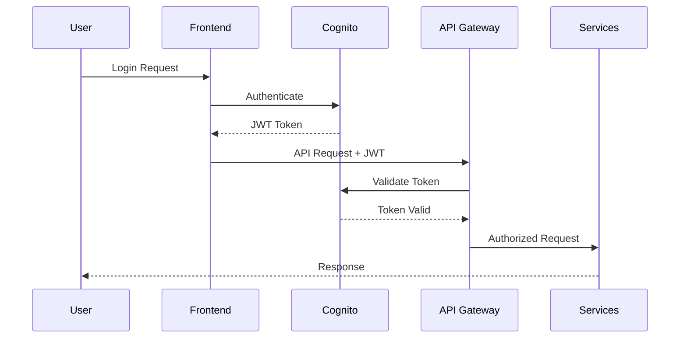

### Authorization Matrix

| Role | Permissions | Access Level | MFA Required |
|------|------------|--------------|--------------|
| Provider | Submit PA, View Status, Upload Documents | Organization-scoped | Yes |
| Payer Reviewer | Review PA, Request Info, Approve/Deny | Queue-scoped | Yes |
| Medical Director | All Reviewer + Override, Policy Management | Global | Yes |
| System Admin | System Configuration, User Management | Global | Yes |
| API Service | Programmatic Access, Limited Scope | Service-specific | N/A |

## 7.2 DATA SECURITY

### Data Protection Layers

```mermaid
graph TD
    subgraph Transport Security
        A[TLS 1.3] --> B[Certificate Management]
        B --> C[Perfect Forward Secrecy]
    end
    
    subgraph Data at Rest
        D[AWS KMS] --> E[AES-256 Encryption]
        E --> F[S3 Server-Side Encryption]
        E --> G[RDS Encryption]
    end
    
    subgraph Access Control
        H[IAM Policies] --> I[Resource-Level Permissions]
        I --> J[VPC Security Groups]
        J --> K[Network ACLs]
    end
```

### PHI Protection Measures

| Data Type | Storage Location | Encryption Method | Access Control |
|-----------|-----------------|-------------------|----------------|
| Patient Records | RDS (Multi-AZ) | TDE with AWS KMS | Row-Level Security |
| Clinical Documents | S3 | SSE-KMS | Bucket Policies |
| Audit Logs | CloudWatch Logs | KMS Encryption | IAM Roles |
| Cache Data | ElastiCache | Encryption in Transit/Rest | Auth Tokens |

## 7.3 SECURITY PROTOCOLS

### Security Architecture

```mermaid
graph TD
    subgraph Edge Security
        A[WAF] --> B[DDoS Protection]
        B --> C[Rate Limiting]
    end
    
    subgraph Application Security
        D[Input Validation] --> E[OWASP Controls]
        E --> F[XSS Prevention]
        F --> G[CSRF Protection]
    end
    
    subgraph Monitoring
        H[GuardDuty] --> I[Security Hub]
        I --> J[CloudTrail]
        J --> K[CloudWatch Alerts]
    end
```

### Security Controls Implementation

| Control Category | Implementation | Monitoring | Compliance Mapping |
|-----------------|----------------|------------|-------------------|
| Access Control | AWS Cognito + Custom RBAC | Login Attempts, Role Changes | HIPAA §164.312(a)(1) |
| Encryption | AWS KMS + TLS 1.3 | Certificate Expiry, KMS Usage | HIPAA §164.312(a)(2)(iv) |
| Audit Logging | CloudTrail + Custom Logs | Log Analysis, Alerts | HIPAA §164.312(b) |
| Network Security | VPC + Security Groups | Traffic Analysis, Threats | HIPAA §164.312(e)(1) |
| Incident Response | AWS Security Hub + SNS | Real-time Alerts, Escalations | HIPAA §164.308(a)(6) |

### Security Compliance Measures

```mermaid
graph LR
    subgraph Compliance Framework
        A[HIPAA Controls] --> B[Technical Safeguards]
        A --> C[Administrative Safeguards]
        A --> D[Physical Safeguards]
    end
    
    subgraph Implementation
        B --> E[Encryption]
        B --> F[Access Control]
        B --> G[Audit Trails]
        C --> H[Policies]
        C --> I[Training]
        D --> J[Facility Access]
    end
    
    subgraph Validation
        E & F & G --> K[Automated Testing]
        H & I & J --> L[Manual Audits]
        K & L --> M[Compliance Reports]
    end
```

### Security Update Protocol

| Component | Update Frequency | Validation Process | Rollback Plan |
|-----------|-----------------|-------------------|---------------|
| OS Patches | Monthly | Test Environment Validation | Automated Rollback |
| Dependencies | Weekly | Security Scan + Integration Tests | Version Control |
| SSL Certificates | 90 Days | Automated Renewal | Backup Certificates |
| Security Policies | Quarterly | Compliance Review | Version History |
| Access Reviews | Monthly | User Activity Audit | Role Snapshots |

# 8. INFRASTRUCTURE

## 8.1 DEPLOYMENT ENVIRONMENT

The Prior Authorization Management System will be deployed entirely on AWS cloud infrastructure to leverage HIPAA-compliant services and maintain high availability.

| Environment | Purpose | Configuration |
|------------|---------|---------------|
| Development | Feature development and testing | Single-AZ, reduced capacity |
| Staging | Integration testing and UAT | Multi-AZ, production-like |
| Production | Live system | Multi-AZ, full redundancy |
| DR | Disaster recovery | Cross-region standby |

```mermaid
graph TB
    subgraph Production Region US-EAST-1
        A[Primary Infrastructure] --> B[AZ-1]
        A --> C[AZ-2]
        B & C --> D[RDS Multi-AZ]
    end

    subgraph DR Region US-WEST-2
        E[Standby Infrastructure] --> F[AZ-1]
        E --> G[AZ-2]
        F & G --> H[RDS Read Replica]
    end

    D -->|Replication| H
```

## 8.2 CLOUD SERVICES

| AWS Service | Purpose | Configuration |
|-------------|---------|---------------|
| ECS Fargate | Container hosting | Auto-scaling, HIPAA-enabled |
| RDS PostgreSQL | Primary database | Multi-AZ, 15.x version |
| ElastiCache | Session/cache management | Redis 7.0, cluster mode |
| S3 | Document storage | Server-side encryption |
| CloudFront | CDN | Edge locations, WAF integration |
| Route 53 | DNS management | Health checks, failover routing |
| API Gateway | API management | REST APIs, throttling enabled |
| Lambda | Serverless functions | Python 3.11 runtime |
| CloudWatch | Monitoring | Enhanced metrics, log retention |
| WAF | Web application firewall | OWASP rules, rate limiting |

## 8.3 CONTAINERIZATION

```mermaid
graph TD
    subgraph Container Architecture
        A[Base Image] --> B[Python 3.11 Alpine]
        B --> C[Application Dependencies]
        C --> D[Application Code]
        
        subgraph Services
            E[API Service]
            F[Worker Service]
            G[Scheduler Service]
        end
        
        D --> E & F & G
    end

    subgraph Registry
        H[ECR Repository]
        I[Image Versioning]
        J[Vulnerability Scanning]
    end

    E & F & G --> H
    H --> I
    H --> J
```

### Container Specifications

| Component | Specification | Details |
|-----------|--------------|---------|
| Base Image | Python 3.11 Alpine | Minimal secure base |
| Image Size | < 500MB | Optimized layers |
| Health Check | TCP + HTTP | 30s interval |
| Resource Limits | CPU/Memory | Dynamic scaling |
| Logging | STDOUT/STDERR | CloudWatch integration |
| Security | No root access | Least privilege |

## 8.4 ORCHESTRATION

ECS Fargate is chosen over Kubernetes for simplified management and HIPAA compliance:

```mermaid
graph TB
    subgraph ECS Cluster
        A[Service Discovery] --> B[Task Definitions]
        B --> C[Container Instances]
        
        subgraph Auto Scaling
            D[Target Tracking]
            E[Step Scaling]
        end
        
        C --> D & E
    end

    subgraph Load Balancing
        F[Application Load Balancer]
        G[Target Groups]
        H[Health Checks]
    end

    C --> F
    F --> G
    G --> H
```

### Service Configuration

| Service | Min Instances | Max Instances | CPU | Memory |
|---------|--------------|---------------|-----|---------|
| API Service | 2 | 10 | 1 vCPU | 2GB |
| Worker Service | 2 | 8 | 2 vCPU | 4GB |
| Scheduler Service | 1 | 2 | 0.5 vCPU | 1GB |

## 8.5 CI/CD PIPELINE

```mermaid
graph LR
    subgraph Development
        A[Code Commit] --> B[Build]
        B --> C[Unit Tests]
        C --> D[SAST Scan]
    end

    subgraph Staging
        D --> E[Deploy to Staging]
        E --> F[Integration Tests]
        F --> G[HIPAA Compliance]
    end

    subgraph Production
        G --> H[Deploy to Prod]
        H --> I[Health Check]
        I --> J[Monitoring]
    end
```

### Pipeline Specifications

| Stage | Tools | SLA | Automation |
|-------|-------|-----|------------|
| Source Control | GitHub Enterprise | < 1min | Auto-triggers |
| Build | AWS CodeBuild | < 5min | Docker multi-stage |
| Testing | pytest, SonarQube | < 10min | Coverage > 80% |
| Security | Snyk, OWASP ZAP | < 15min | Zero high severity |
| Deployment | AWS CodeDeploy | < 15min | Blue-green |
| Validation | Synthetic tests | < 5min | Automated rollback |

### Deployment Strategy

| Type | Method | Rollback Time | Downtime |
|------|--------|---------------|-----------|
| Normal Release | Blue-green | < 5min | Zero |
| Hotfix | Rolling update | < 2min | Zero |
| Database Migration | Staged | < 30min | < 5min |
| Infrastructure Update | Terraform | < 10min | Zero |

# APPENDICES

## A. ADDITIONAL TECHNICAL INFORMATION

### A.1 Integration Endpoints

| System | Base URL | Authentication | Rate Limits |
|--------|----------|----------------|-------------|
| EPIC FHIR | `https://fhir.epic.com/interconnect-fhir-oauth/api/FHIR/R4/` | OAuth 2.0 | 10,000/hour |
| UHC API | `https://api.uhc.com/api/v1/` | JWT | 5,000/hour |
| Claude API | `https://api.anthropic.com/v1/` | API Key | 1,000/hour |
| Drug Database | `https://api.fdb.com/v1/` | API Key | 3,000/hour |

### A.2 Error Response Codes

```mermaid
graph TD
    A[Error Response] --> B[4xx Client Errors]
    A --> C[5xx Server Errors]
    
    B --> D[400 Bad Request]
    B --> E[401 Unauthorized]
    B --> F[403 Forbidden]
    B --> G[404 Not Found]
    B --> H[429 Too Many Requests]
    
    C --> I[500 Internal Error]
    C --> J[502 Bad Gateway]
    C --> K[503 Service Unavailable]
    C --> L[504 Gateway Timeout]
```

### A.3 Backup Schedule

| Type | Frequency | Retention | Storage |
|------|-----------|-----------|---------|
| Full Database | Daily | 30 days | S3 Glacier |
| Transaction Logs | 5 minutes | 7 days | S3 Standard |
| Configuration | Weekly | 90 days | S3 Standard |
| Document Files | Real-time | 7 years | S3 Standard-IA |

## B. GLOSSARY

| Term | Definition |
|------|------------|
| Blue-Green Deployment | A deployment strategy using two identical environments to minimize downtime |
| FHIR Bundle | A collection of FHIR resources that can be treated as a single unit |
| Da Vinci Project | An HL7 FHIR accelerator project focused on value-based care workflows |
| Formulary | A list of prescription drugs covered by a health insurance plan |
| Policy Criteria | Specific requirements that must be met for drug approval |
| Step Therapy | A type of prior authorization requiring patients try lower-cost drugs before expensive ones |
| Transaction Boundary | The scope of a database transaction that maintains ACID properties |
| Warm Standby | A disaster recovery configuration where backup systems run continuously |

## C. ACRONYMS

| Acronym | Full Form |
|---------|-----------|
| ACID | Atomicity, Consistency, Isolation, Durability |
| API | Application Programming Interface |
| CDN | Content Delivery Network |
| CRUD | Create, Read, Update, Delete |
| EMR | Electronic Medical Record |
| FHIR | Fast Healthcare Interoperability Resources |
| HIPAA | Health Insurance Portability and Accountability Act |
| HL7 | Health Level Seven |
| IAM | Identity and Access Management |
| JWT | JSON Web Token |
| KMS | Key Management Service |
| LLM | Large Language Model |
| MFA | Multi-Factor Authentication |
| RBAC | Role-Based Access Control |
| REST | Representational State Transfer |
| RDS | Relational Database Service |
| S3 | Simple Storage Service |
| SLA | Service Level Agreement |
| TLS | Transport Layer Security |
| VPC | Virtual Private Cloud |
| WAF | Web Application Firewall |

## D. COMPLIANCE MAPPING

```mermaid
graph TD
    subgraph HIPAA Requirements
        A[Security Rule] --> B[Technical Safeguards]
        A --> C[Administrative Safeguards]
        A --> D[Physical Safeguards]
    end
    
    subgraph System Implementation
        E[Encryption] --> B
        F[Access Control] --> B
        G[Audit Logs] --> B
        H[Policies] --> C
        I[Training] --> C
        J[Facility Security] --> D
    end
    
    subgraph AWS Services
        K[KMS] --> E
        L[Cognito] --> F
        M[CloudWatch] --> G
        N[CloudTrail] --> G
        O[IAM] --> F
    end
```